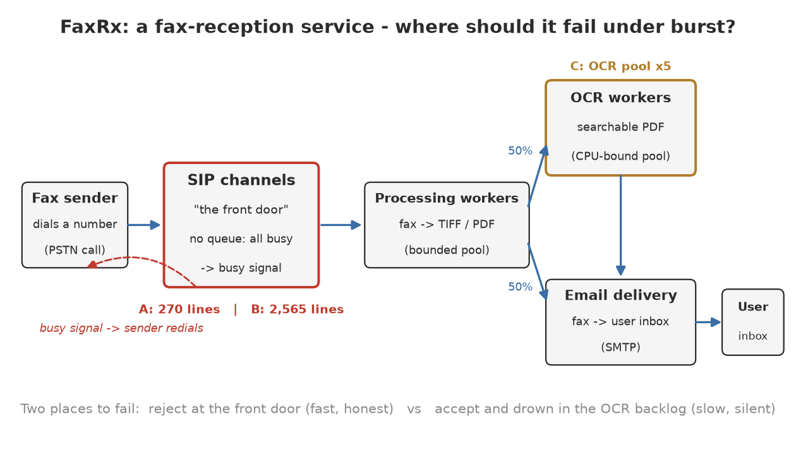
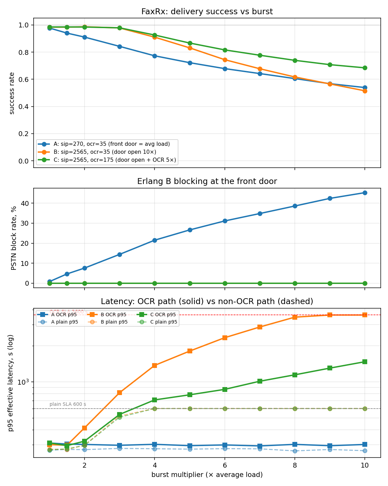

# Fail fast or fail slow: where should your system break under load?

> **Type: record** — publication: frozen once published · born 2026-07-17

*English long form of the story first told in a [LinkedIn post
(2026-07-13)](https://www.linkedin.com/in/gserdyuk/). All numbers come from the
open, reproducible model in
[`examples/FaxRx`](https://github.com/gserdyuk/twotakt/tree/main/examples/FaxRx).*

---

Many years ago I worked on a PSTN fax-reception service: you buy a number in the
country you need, and every fax sent to it lands in your inbox as a PDF. Recently —
mostly out of curiosity — I went back to that system and modeled several variants
of its architecture in SimPy.

One result deserves its own story. Two architectures showed **the same success rate**
under a 10× traffic burst — yet one of them is clearly worse for the users. The
interesting part: the success-rate metric is *structurally unable* to see the
difference. Here is the system, what I modeled, and why the "undersized front door"
turned out to be not a defect but the system's best protective mechanism.

## The system

The pipeline looks like this:

- A sender dials the number — the call arrives at the operator's **SIP channels**
  (T.38, fax-over-IP). These are the system's front door, and they have a property
  we will get to shortly.
- **Processing workers** receive the fax and convert it to TIFF/PDF.
- About **half of the faxes** continue to **OCR** — users with the paid option get a
  searchable PDF instead of an image. OCR is a CPU-bound pool, the heaviest
  computational stage of the pipeline.
- **Email delivery** sends the result to the user's mailbox.

The service has two SLAs: a regular fax must be delivered within **10 minutes**, an
OCR fax within **1 hour**. Average load is about 2.8 faxes per second during
business hours; a call lasts about 90 seconds on average.

Traffic is not uniform: two morning peaks (European and American) produce bursts
several times above the night base. So the real sizing question is not "how much
does the system handle on average" but **what happens when a burst exceeds its
capacity**.

## The question I wanted the simulation to answer

The classic capacity-planning question is "how much hardware do I need to survive
load X". There is a second question, asked far less often: **where exactly should
the system break when X is exceeded anyway?**

This is not rhetoric. The failure point is an architectural decision, designed the
same way throughput is. And, as the simulation will show, two variants with the
same count of surviving requests give the people on the other side of the system
opposite experiences.

## A door with no queue: why a phone line is a special resource

A telephone line has a property ordinary backend resources lack: **it cannot form a
queue**. If all channels are busy, a new call does not wait — the sender hears a
busy tone immediately and hangs up. In queueing theory this is the Erlang B model:
losses instead of waiting.

How many channels do we need? Offered load = arrival rate × duration:
2.8 faxes/s × 90 s = 250 erlangs. By the Erlang B formula, keeping blocking at 1%
takes **about 270 channels**. Surviving a 10× burst without blocking takes **about
2,565**. Channels cost money, so the temptation to save on the "door" is real —
the only question is what happens when the burst does arrive.

## The model: three architectures and honest metrics

I built a discrete-event model in SimPy: the SIP layer as Erlang B (no queue,
instant blocking), processing workers as M/M/c, OCR as M/M/c with degradation
following the Universal Scalability Law (a CPU-bound pool does not scale linearly).
Then a sweep: **three architectures × eleven burst levels**, 1× to 10×:

- **A — "door sized for the average":** 270 SIP channels, 35 OCR workers.
- **B — "open the door wide":** 2,565 channels, same backend.
- **C — "wide door + 5× the OCR":** 2,565 channels, 175 workers.

A word about metrics. If under overload you measure latency **only for successful
requests**, the system looks healthiest exactly when it suffers most: slow requests
die by timeout and vanish from the statistics (survivorship bias). So the model's
primary metric is **effective latency**: a timeout is counted at its SLA cost, not
discarded. Every p95 below is effective.

## Results

| Burst | A: success / block / p95 | B: success / block / p95 | C: success / block / p95 |
|---|---|---|---|
| 1×  | 0.98 / 0.8% / 291 s | 0.98 / 0 / 287 s | 0.99 / 0 / 291 s |
| 3×  | 0.84 / 14% / 288 s | 0.98 / 0 / 748 s | 0.98 / 0 / 520 s |
| 5×  | 0.72 / 27% / 284 s | 0.83 / 0 / 1,734 s | 0.87 / 0 / 717 s |
| 10× | 0.54 / 45% / 286 s | 0.52 / 0 / 3,600 s | 0.68 / 0 / 1,402 s |

**Architecture A fails fast and honestly — at the edge.** As the burst grows,
Erlang B rejects more and more calls: 0.8% → 45%. Sounds terrible? Look at the
third number in the column: everything that *made it through* the door was
delivered on time — p95 stands nailed at ~285 seconds across the whole range, up
to 10×. And a rejected sender learns about the rejection **instantly** — and
simply dials again.

**Architecture B fails slowly and silently — inside.** Blocking is gone entirely
(the block column is zeros). But watch the p95: 287 → 748 → 1,734 → 3,600 seconds.
The queue quietly drowns the OCR pool, latency creeps up until it hits the
one-hour SLA ceiling. At 10× the success rate of B is **0.52 versus 0.54 for A.
Statistically the same number.** But the failure is qualitatively different: the
fax was *accepted*, the sender walked away confident everything was fine — and the
fax died in a queue an hour later. Nobody redials, because nobody knows.

**Architecture C: more hardware helps but does not save you.** Noticeably better
at mid-range bursts (0.87 vs 0.83 at 5×), but at 10× — success 0.68 and p95 of
1,400 seconds, five times worse than A. Adding capacity **postpones** the
slow-failure regime. It does not change its nature.

## The lesson

The success-rate figure tells you **how much** the system carries — and says
nothing about **where** it breaks. Two architectures with the same success rate
gave users opposite experiences: a fast, honest "busy, try again" versus a silent
loss discovered an hour later.

Hence the conclusion I would have loved to get on paper back then: **an undersized
front door is not a defect — it is admission control.** By accepting work you
cannot finish, you convert fast honest failures into slow hidden ones — without
even improving the success rate.

It pays to distinguish two kinds of loss that the metric merges into one number:

- **admission loss** — rejected by design, instantly and explicitly;
- **congestion loss** — accepted, then lost in a queue.

The first is behavior you designed. The second is behavior that happened to you.

## What this means for your systems (which have no faxes)

The telephone busy tone is the oldest load shedding in the world, built into the
very nature of the PSTN. In modern systems the same choice looks like this:

- a bounded connection pool that rejects immediately — or an unbounded message
  queue that grows for hours;
- a fast 429/503 with Retry-After at the edge — or a request hanging to its
  timeout deep inside;
- backpressure that reaches the client — or buffers that "mercifully" hide it
  until they burst.

The rule is the same as with faxes: if the system is destined to refuse, let it
refuse at the edge, fast and honestly, while the client can still react. To accept
and silently fail is the worst of all answers.

## Reproducibility

The model, its specification and the full sweep are open:
[`examples/FaxRx`](https://github.com/gserdyuk/twotakt/tree/main/examples/FaxRx)
in the twotakt repository — every number in the table can be reproduced
(`sweep.py`, 33 runs) and any parameter changed. Next to it, `verify.py` — the set
of invariant checks that separate "the model computes correctly" from "the model
computes prettily".

twotakt itself is a workflow for building SimPy models you can trust: first a
model specification (MODEL.md) that a human approves, then code that is verified
against it. But that is a topic for another article.

**An honest limitation of this model:** redials are not modeled — a rejected
sender disappears, while in reality Erlang retries would raise the effective load
on architecture A. The next extension is a redial loop with exponential backoff,
showing how much of A's advantage survives retry pressure. It does not affect the
main conclusion though: redialing *is* the fast honest failure the client can
react to.
