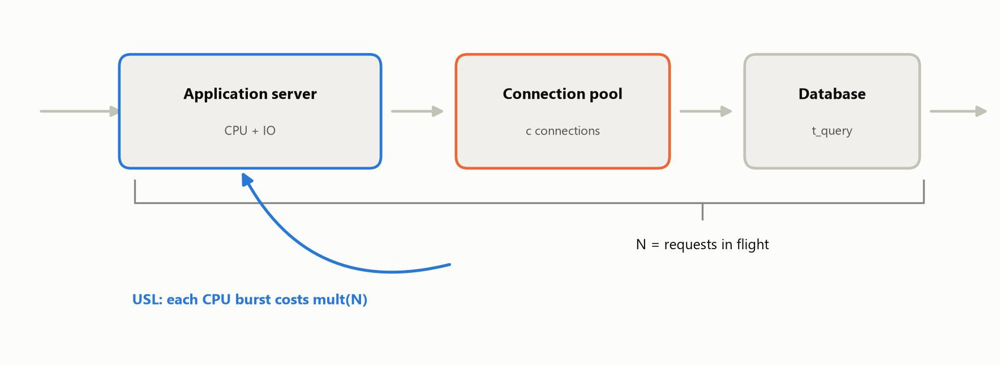
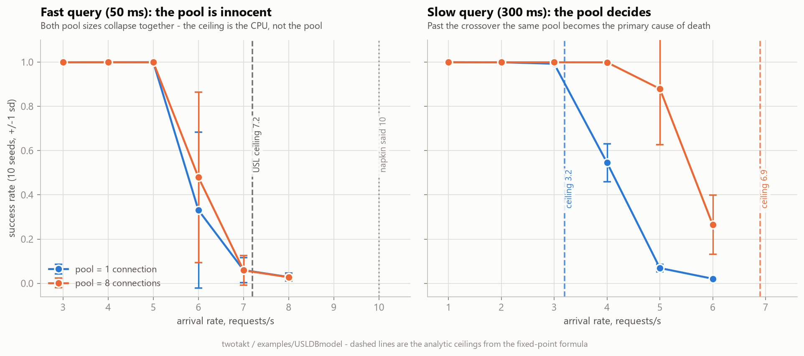

# min(10, 20) = 6: where is the system's bottleneck?

> **Type: record** — publication: frozen once published · born 2026-07-31

*English long form of the story first told in a [LinkedIn post
(2026-07-31)](https://www.linkedin.com/feed/update/urn:li:activity:7488714946508288000/).
All numbers come from the open, reproducible model in
[`examples/USLDBmodel`](https://github.com/gserdyuk/twotakt/tree/main/examples/USLDBmodel);
every point is 10 seeded runs, mean and spread.*

---

Take the simplest system with two resources: an application server (CPU) with a
database behind it. A request does a little CPU work, waits a little on I/O, then
takes a connection from a bounded pool, runs one database query — and leaves.



The capacity of the parts fits on a napkin:

- **CPU:** a request costs 0.10 s of processor time → ceiling **10 requests/s**.
- **Database:** a query takes 0.05 s and there is exactly one connection → ceiling
  **20 requests/s**.

So, by the classic formula "bottleneck = the minimum of the ceilings": the system
should sustain 10 requests/s, the CPU is the limiting component, and the single
database connection has a 2× margin.

The simulation (a discrete-event model in SimPy) returns a different verdict: **the
system collapses at six.** At 5 requests/s — 100% success. At 7 — the system is
dead. No component ever reached its own ceiling.

## Suspect number one

We blamed the pool first. A single connection! The classic starved pool: requests
serialize, waiting burns the deadline — a familiar story, the diagnosis suggests
itself.

The check is simple: enlarge the pool and see whether the collapse point moves. Ten
seeded runs per point, mean and spread:

| Requests/s | Success, pool = 1 | Success, pool = 8 |
|---|---|---|
| 4 | 1.00 (±0.00) | 1.00 (±0.00) |
| 5 | 1.00 (±0.00) | 1.00 (±0.00) |
| 6 | 0.33 (±0.35) | 0.48 (±0.39) |
| 7 | 0.06 (±0.06) | 0.06 (±0.07) |
| 8 | 0.03 (±0.02) | 0.03 (±0.01) |

The pool is **acquitted**. Eight connections instead of one — and the collapse
point did not move: both configurations die between 5 and 7. (We will come back to
the "6 requests/s" row and its spread.) Whoever is killing the system at six, it is
not the database.

Then who? The CPU is rated for 10. The system dies at 6. A 1.5× gap is not a
rounding error.

## Remembering USL

We computed the "10 requests/s" ceiling as `1 / 0.10` — as if the cost of a request
did not depend on how many requests are being processed at once. For a real server
that is false: the more threads in flight, the more each one costs — contention for
caches, locks, the scheduler, GC. This is what the Universal Scalability Law (USL)
describes: the work of one request is multiplied by a degradation factor

```
mult(N) = 1 + α(N−1) + βN(N−1)
```

where N is the number of requests in flight, α is linear contention, β is the
quadratic coherency penalty. In our model α = 0.02, β = 0.001 — modest, realistic
values.

Two steps follow, both elementary.

**Step 1: N depends on the response time.** By Little's law, `N = X · R`: the
number of requests in the system equals throughput times residence time. And N
counts **all** requests in flight — including those waiting on I/O and those queued
for the database. They never touch the CPU, but they inflate N — and through
`mult(N)` they make the CPU's work heavier.

**Step 2: the response time depends on N.** CPU work costs `D · mult(N)`, and with
the queue for the processor the CPU residence time grows as `D · mult(N) / (1 − ρ)`,
where the utilization is `ρ = X · D · mult(N)`.

The circle closes: N determines R, R determines N. This is a fixed-point equation:

```
N = X · [ D·mult(N) / (1 − X·D·mult(N)) + Z ]
```

(Z is the time spent off-CPU: I/O and the database query.) At small X the equation
has a stable solution — the system works. As X grows, the solution exists up to a
limit, and then **vanishes**: the feedback "more requests in flight → each one
costs more → longer in the system → even more in flight" stops converging. That
limit is the system's true ceiling.

For our parameters it is computed numerically in seconds: **X\* ≈ 7.2 requests/s.**

Not 10. The naive ceiling is 28% too high — with modest α and β. The simulation
collapses between 5 and 7; the formula says 7.2. The numbers agree — and it becomes
visible that the "CPU ceiling" is not a constant at all: it depends on N, that is,
on everything happening around the CPU, including the time requests spend in I/O
and in the queue for the database.

**An honest caveat about the knee.** In the simulation the breakdown starts about
1 request/s *below* the deterministic ceiling, and right at the knee (that
"6 requests/s" row) the outcome of a run is bimodal: some seeds give ~1.0, others
~0.05 — the mean of 0.33 is a value the system never actually shows. Near a fixed
point on the verge of vanishing, a random burst of load shoves the system into a
runaway it does not come back from. The practical conclusion is short: **a single
load-test run near the knee is a coin flip, not a measurement.** Measure in series
and look at the spread, not the mean.

## So when is the pool guilty?

The pool is acquitted *in this regime* — not in general. The pool has its own
ceiling: `c / t_query`, where c is the pool size. It becomes the system's
bottleneck when that ceiling drops below the CPU's:

```
t_query > c / X_cpu*
```

For one connection and X\* ≈ 7.2 the threshold is **≈ 0.14 s**. Our query cost
0.05 s — three times below the threshold, which is why the pool was innocent: its
ceiling (20) hung far above the CPU ceiling (7.2) and influenced nothing.

Now make the query slow — 0.3 s (a loaded cluster, a heavy query — not exotic).
The threshold is crossed, and the formula predicts: with pool = 1 the ceiling drops
to **≈ 3.2**; with pool = 8 the pool again does not bind — the CPU remains, with a
ceiling of **≈ 6.9** (slightly below 7.2: a slow query holds its connection longer,
N is larger, USL bites harder).

The simulation, same 10 seeds per point:

| Requests/s | Success, pool = 1 | Success, pool = 8 |
|---|---|---|
| 2 | 1.00 (±0.00) | 1.00 (±0.00) |
| 3 | 0.99 (±0.01) | 1.00 (±0.00) |
| 4 | 0.55 (±0.09) | 1.00 (±0.00) |
| 5 | 0.07 (±0.02) | 0.88 (±0.25) |
| 6 | 0.02 (±0.01) | 0.26 (±0.13) |

Pool = 1 collapses between 3 and 4 (formula: 3.2). Pool = 8 holds to 5 and
collapses between 5 and 6 (formula: 6.9). Both predictions land — and note the
spread: where the pool is the bottleneck (the "4" row), the effect is clean and
stable (±0.09 versus ±0.35 at the CPU knee). The resource interaction here is real:
the single connection serializes requests, waiting burns the deadline, and the
system dies at half the CPU's ceiling.



The same system. The same pool. In one regime it is a non-entity; in the other, the
primary cause of death. **"What is the bottleneck" is a property of the regime, not
of the component.**

## The lesson

A bottleneck is not a property of a component — it is the conditions the system
puts that component in. And the influence runs both ways: the system loads the
component, and the component, slowing down, loads the system back. The formula
`min(ceilings)` silently assumes the influence is one-way — load presses on the
component, and that is all.

Mathematicians call such an equilibrium a fixed point, and its disappearance a
bifurcation. The irony is that the "fixed" point is precisely what moves: the
regime drags it along — and the system's ceiling is where it has nowhere left to
go and vanishes. There is no solution — queues grow, and the system simply stops
coping.

Two consequences, both of which we saw in the numbers:

- **A component's ceiling is not a spec-sheet constant.** It depends on the number
  of requests in flight — and therefore on I/O, on queues to neighboring resources,
  on everything that lengthens a request's stay in the system. The USL correction
  has a closed form — but you have to compute it: the naive 10 became 7.2.
- **The culprit depends on the regime.** The threshold `t_query > c / X_cpu*` flips
  the bottleneck from the CPU to the pool. On spec-sheet ceilings this switch is
  invisible in principle — it lives in the mutual influence.

Hence the procedure I wish the napkin had instead of `min()`: first compute the
honest ceiling of the dominant resource (with degradation), then check which of the
remaining resources drop below it in *your* regime — and only then name the
bottleneck.

## What this means for your systems

A familiar picture: the service passed per-component load tests, every subsystem
holds its rated load — and in production everything falls over "below all limits",
with no culprit on any dashboard. The instinct is to hunt for the saturated
component. There is none. Look instead for a pair of resources where pressure on
one multiplies concurrency on the other:

- a thread pool feeding a smaller connection pool;
- a fleet of async workers sharing a rate-limited external API;
- any request that holds a scarce resource across a slow call it does not control.

And two measurement rules: near the knee, measure in series (a single run is a coin
flip); and if upgrading the "bottleneck" did not move the collapse point — you
fixed the wrong resource, recompute the regime.

## Reproducibility

The model, its specification, and all the runs are open:
[`examples/USLDBmodel`](https://github.com/gserdyuk/twotakt/tree/main/examples/USLDBmodel)
in the twotakt repository. Every number in the tables is reproducible; next to the
model, `verify.py` — the checks that separate "the model computes correctly" from
"the model computes prettily".

**An honest limitation.** The model is simple: one database query per user request,
no variance in query cost, no cache, no database-side degradation. Each of these
simplifications would shift the numeric thresholds; none cancels the structure of
the conclusion — a component's ceiling as a function of the regime, and a
computable bottleneck switch.

And a confession from the kitchen: the first version of this article rested on a
single run near the knee — and a ten-seed re-check killed it. The advice "measure
in series" has been tested on ourselves.
