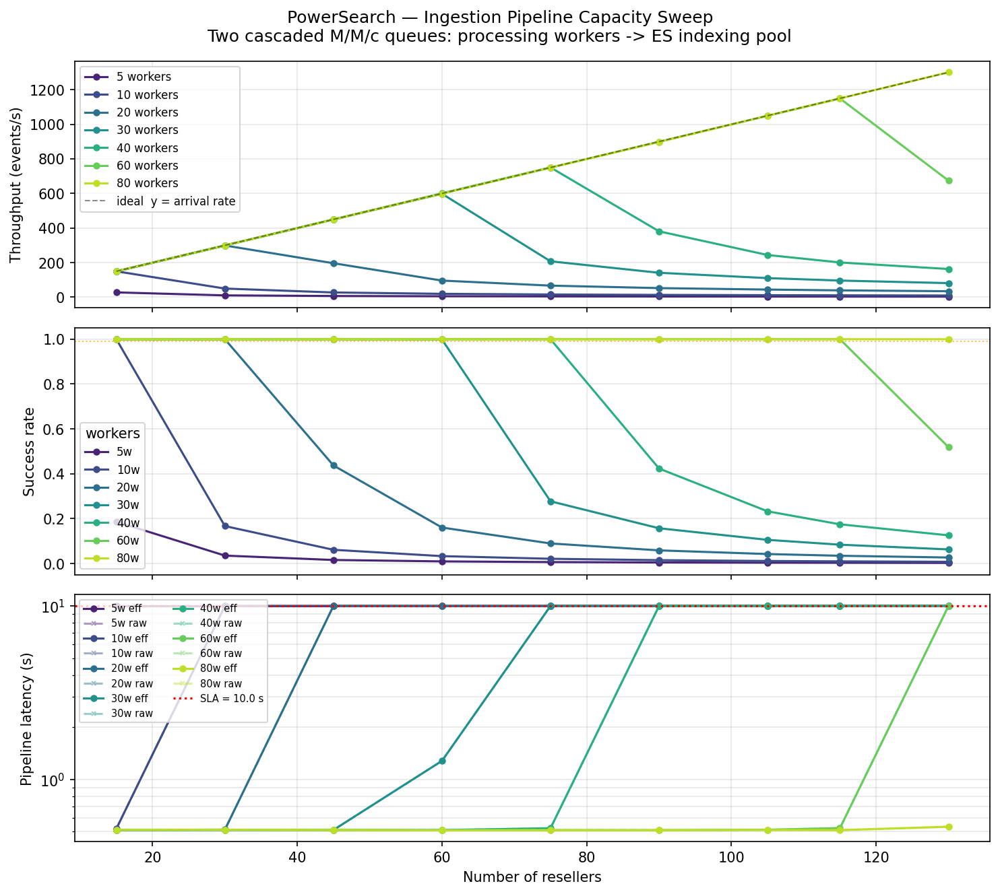
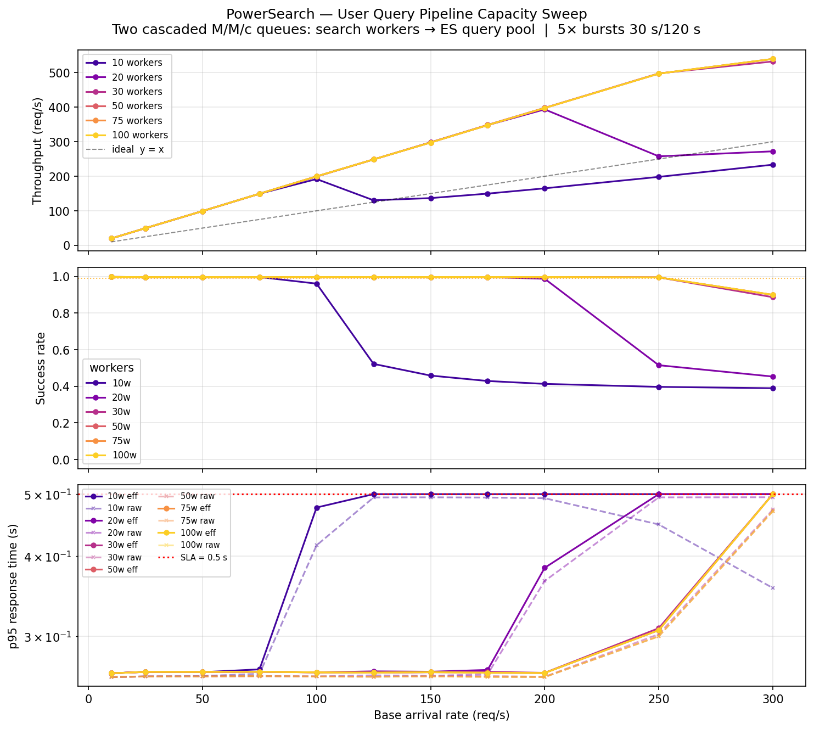

# PowerSearch — Performance Simulation Report

**Date:** 2026-05-04  
**Models:** two SimPy simulations, M/M/c queueing theory  
**Repository:**
- [`examples/PowerSearch/model1_ingestion/`](model1_ingestion/) — Ingestion Pipeline  
- [`examples/PowerSearch/model2_queries/`](model2_queries/) — User Query Pipeline

---

## Context

PowerSearch is a clothes price aggregator. The system consists of two independent pipelines:

1. **Ingestion Pipeline** — receives price updates from resellers via Kafka and writes them to Elasticsearch.
2. **User Query Pipeline** — serves user search requests against Elasticsearch.

Each pipeline is modelled as **two cascaded bounded pools (M/M/c)**:
- worker pool (primary variable) → ES connection pool (secondary resource)

Workers are I/O-bound (they wait on ES, they do not burn CPU), so USL degradation is disabled (`alpha = beta = 0`).

---

## Model 1 — Ingestion Pipeline

### Model parameters

| Parameter | Value | Justification |
|---|---|---|
| `update_rate_per_reseller` | 10 ev/s | Crawling ~10,000 items per ~17 min cycle |
| `processing_time_mean` | 50 ms | Normalization + deduplication (CPU-light) |
| `es_indexing_time_mean` | 150 ms | Typical ES single-doc write (10–200 ms range) |
| `es_pool_size` | 200 | At 115 resellers ≥ 173 connections are needed; taken with headroom |
| `sla_seconds` | 10 s | "A price change is visible in search within 10 s" |
| `sim_time` | 600 s | Steady state, no burst |

Load: `arrival_rate = num_resellers × 10 ev/s`

| Year | Resellers | Load |
|---|---|---|
| Year 1 | 15 | 150 ev/s |
| Year 3 | ~60 | 600 ev/s |
| Year 5 | 115 | 1150 ev/s |

### Plot



*Three panels, shared X axis = number of resellers. Curves = different worker counts (5 → 80).*

### Interpretation

**Panel 1 — Throughput.**  
The black dashed line is the ideal (throughput = arrival rate). While the curves stay "pinned" to it, the system is keeping up. A downward departure means events are starting to be dropped on the SLA timeout.

- 5 and 10 workers: depart from the ideal already at 20–30 resellers (200–300 ev/s). The system saturates an order of magnitude earlier than Year 5.
- 60 workers: holds up to ~115 resellers (1150 ev/s) — exactly Year 5.
- 80 workers: essentially ideal across the whole range.

**Panel 2 — Success rate.**  
The orange line = 99% — the minimum business threshold.

- At 5 workers success_rate collapses to 0 at ~30 resellers.
- At 60 workers: success_rate ≥ 99% all the way to ~115 resellers.
- At 80 workers: success_rate ≥ 99% across the whole range up to 130 resellers.

**Panel 3 — p95 latency (log scale, SLA = 10 s).**  
The red dashed line = SLA. The key effect: **survivorship bias** — under overload the solid line (`eff p95`) rises toward the SLA while the dashed line (`raw p95`, successful requests only) stays low, creating the illusion of a healthy system. These two lines diverge exactly at the moment of saturation: raw metrics cannot be used for decision-making.

### Conclusions for Model 1

| Year | Resellers | Arrival rate | Min. workers | Recommended workers |
|---|---|---|---|---|
| Year 1 | 15 | 150 ev/s | **10** | 10 |
| Year 2 | 30 | 300 ev/s | **20** | 20 |
| Year 3 | 60 | 600 ev/s | **30** | 40 |
| Year 4 | 90 | 900 ev/s | **40** | 60 |
| Year 5 | 115 | 1150 ev/s | **60** | 80 |

Growth is roughly linear: **~0.65 workers per added reseller**.

**The 10 s SLA requirement is achievable across the entire Year 1–5 horizon.**  
The ES pool (200 connections) never becomes the bottleneck in any scenario — the worker pool always saturates first.

**Risk:** if `es_indexing_time_mean` is actually 300 ms in production (a loaded cluster), 1.5–2× more ES connections will be needed (>200 → 300+) and ~30% more workers at Year 5.

---

## Model 2 — User Query Pipeline

### Model parameters

| Parameter | Value | Justification |
|---|---|---|
| `base_arrival_rate` | 100 req/s (default) | ~1M users × 10 searches/day / 3 regions / 28800 peak seconds × 3× peak |
| `search_time_mean` | 20 ms | Parsing + building the ES query, no I/O |
| `es_query_time_mean` | 80 ms | Full-text search with facets, warm index |
| `burst_multiplier` | 5× | Marketing campaign / evening prime time |
| `burst_duration` | 30 s | Short spike |
| `burst_interval` | 120 s | One burst every 2 minutes → 25% burst duty cycle |
| `sla_seconds` | 0.5 s | E-commerce standard: p95 < 500 ms |
| `sim_time` | 600 s | 5 burst episodes per run — enough for a stable p95 |

**Burst peak**: `burst_rate = base_arrival_rate × 5`  
At `base = 100 req/s` → peak `500 req/s` for 30 s every 120 s.

### Plot



*Three panels, shared X axis = base load (req/s). Curves = different worker counts (10 → 100). Metrics include the burst effect.*

### Interpretation

**Panel 1 — Throughput.**  
Ideal line: y = x. At saturation the curves drop below it — requests are dropped.

| Workers | Saturation point (departure from y = x) |
|---|---|
| 10 | ~50–75 req/s |
| 20 | ~100–125 req/s |
| 30 | ~150–175 req/s |
| 50 | ~200–225 req/s |
| 75 | ~250 req/s |
| 100 | ~275–300 req/s |

**Panel 2 — Success rate.**  
At `base = 100 req/s` (the default Year 5):

- 10 workers: success_rate ≈ 0.5 — the system is in collapse.
- 20 workers: ~0.85–0.90 — does not meet 99%.
- 30 workers: ~0.95–0.97 — still below 99%.
- 50 workers: ≥ 0.99 — SLA threshold cleared.
- 75 and 100 workers: comfortably above 99%.

**Panel 3 — p95 response time (log scale, SLA = 0.5 s).**  
The red line = 500 ms. **Survivorship bias** is especially visible on this plot: under overload the dashed curves (`raw p95`, successful requests only) hold at 100–200 ms, while the solid ones (`eff p95`) are already pinned at 500 ms. The gap between them = the fraction of users who got a timeout instead of a response.

At `base = 100 req/s`:
- `eff p95` first drops below 500 ms between 30 and 50 workers.
- Reliable SLA compliance: **50 workers**.

### Conclusions for Model 2

| Scenario | Base rate | Burst peak | Min. workers | Recommended |
|---|---|---|---|---|
| Year 5, default | 100 req/s | 500 req/s | **50** | 75 |
| Moderate growth | 150 req/s | 750 req/s | **75** | 100 |
| Aggressive growth | 200 req/s | 1000 req/s | **100** | 150 |
| Heavy scenario | 300 req/s | 1500 req/s | **>100** | horizontal scaling |

**The p95 < 500 ms requirement is achievable**, but with an important caveat: provisioning must target the **burst peak**, not the average load. The minimum number of workers to clear the SLA under burst is 2–3× higher than what steady-state requires.

**Risk:** if `es_query_time_mean` is actually 200 ms in production (cold index, rare terms), the saturation point shifts left — ~40% more workers will be needed for the same load.

---

## Overall conclusion

| Pipeline | SLA | Status | Condition |
|---|---|---|---|
| Ingestion (Model 1) | 10 s | **Achievable** | 60–80 workers by Year 5; growth is linear |
| User Queries (Model 2) | p95 < 500 ms | **Achievable** | ≥ 50 workers at base 100 req/s; provision for burst |

**Main takeaway on survivorship bias**: in both pipelines the raw latency metrics (successful requests only) give an optimistic picture under overload. For operational decisions use only `eff_latency_p95` — it honestly accounts for all timeouts.

**Monitoring recommendation**: in production, watch `success_rate` and `eff_latency_p95`. As soon as `success_rate` drops below 99% the system is already degrading, even if raw p95 still looks fine.

---

## Reproducing the results

```bash
# Model 1 — Ingestion
cd examples/PowerSearch/model1_ingestion
pip install -r requirements.txt
python server_sim.py      # smoke test
python sweep.py           # ~2 min, generates sweep_results.json
python plot_sweep.py      # generates sweep_plot.png

# Model 2 — User Queries
cd examples/PowerSearch/model2_queries
pip install -r requirements.txt
python server_sim.py      # smoke test + survivorship bias check
python sweep.py           # ~3 min, generates sweep_results.json
python plot_sweep.py      # generates sweep_plot.png
```
