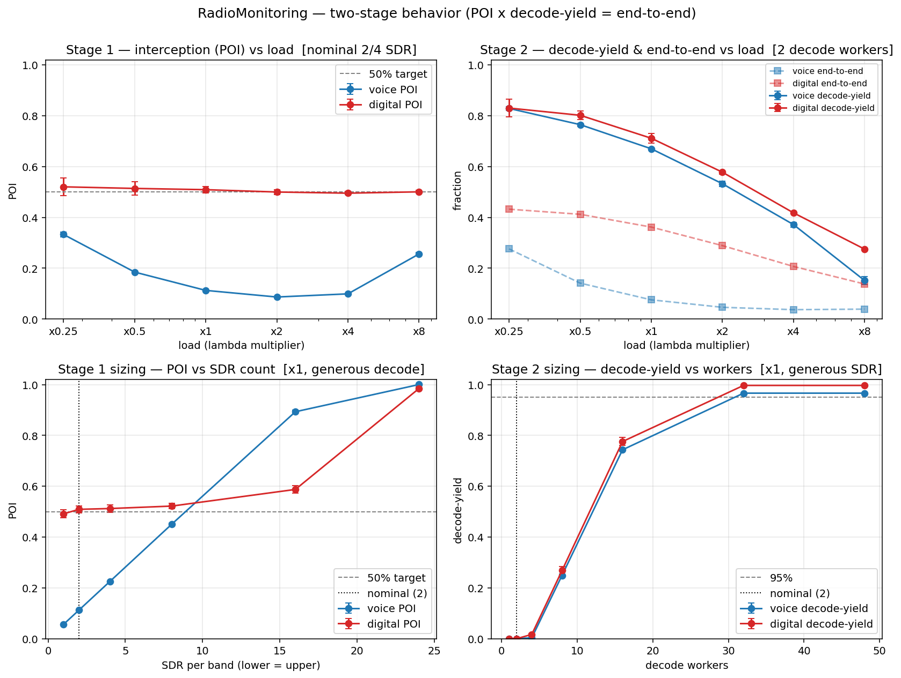

# RadioMonitoring

A two-stage SimPy model of a frontline radio-spectrum surveillance system, built
with the audit-first simpy-protocol. The question: **what fraction of an adversary's
channel activity does the system intercept and decode end-to-end (POI × decode-yield),
and how must it be sized to hit POI ≥ 50 %?**

## Input

- **ТЗ:** [REQUIREMENTS.md](REQUIREMENTS.md) — scenario, workload (frequency plan:
  64 voice + 10 digital channels, drones/radar as interference), POI ≥ 50 % target.
- **Architecture:** [ARCHITECTURE.md](ARCHITECTURE.md) — two scan roles + recording
  SDR pools (2 lower / 4 upper), industrial PC, and the decode stage (queue 100 000
  + 2 workers, co-located or on separate machines over gigabit LAN).

## Model

[MODEL.md](MODEL.md) / [MODEL.ru.md](MODEL.ru.md) — the approved spec. Two stages:

- **① Intercept** (scarce = SDR pool): observer SDRs hop the bank (= recovered
  frequency plan) and record. Record-first; classification is concurrent (sets the
  length cap, does not gate). Target = a *channel activity block*; lost the instant
  the channel goes quiet if no SDR is recording it. Metric: **POI**, buckets A/C.
- **② Decode** (scarce = decode workers), decoupled — does not affect POI:
  recording → bounded queue (drop = bucket G) → workers → decode (t_proc = 0.5 + R·L).
  Metric: **decode-yield**. End-to-end = POI × decode-yield.

Idle SDRs sleep until the next block start (efficiency; revisit latency preserved).

## How to run

```bash
pip install -r requirements.txt
python verify.py        # V&V — Tier-1 ledger invariants + Tier-2 Erlang-A signature
python sweep.py         # text: load + SDR sizing + decode sizing
python plot_sweep.py    # writes sweep.png (4 panels)
```

Runs are capped short by default (`sim_time = 600 s`); add seeds, not length.

## Result



The reference hardware (2/4 SDR, 2 decode workers) is **undersized at both stages**;
end-to-end yield at nominal load is only ~7–8 %.

- **Stage ① (interception)** is bound by **voice**: an 8 s voice record ties up an
  SDR ~16× longer than a 0.5 s digital burst, so 64 voice channels swamp 2 lower
  SDRs. Voice POI ≥ 50 % needs **~8–16 SDR per band** (nominal 2 → ~11 %).
- **Stage ② (decode)** is tighter: with generous receivers, **2 workers yield ≈ 0 %**
  (recordings pile up in the queue). Reaching ~96 % needs **~32 workers**.
- Voice POI is **non-monotonic** in load — a block-merging artifact of counting POI
  per channel (continuously busy channel = one long block).
- Placement (co-located vs separate machines) is ~equivalent at gigabit with
  decimated recordings — the LAN is non-binding.

**To hold POI ≥ 50 % and decode-yield ≥ 95 % end-to-end: ~12–16 SDR/band + ~32 decode
workers**, not 2/4 + 2.
